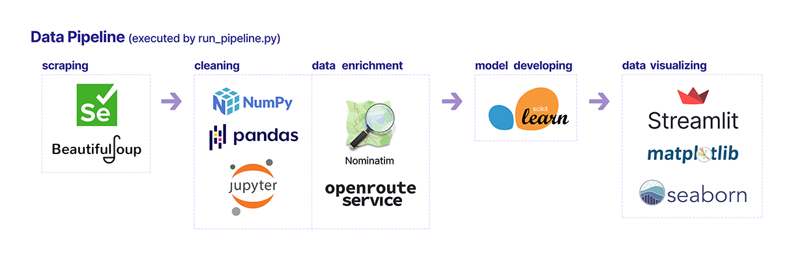

# 🔍🏠 Home Market Harvester Project

## 📋 Overview

The Home Market Harvester is an all-encompassing data pipeline tailored to `gather` -> `purify` -> `analyze` -> `train model` -> `display information` on the real estate market. This system targets specific regions, juxtaposing chosen listings against the broader market context.

Culminating in an interactive dashboard, it presents an aggregate view of local market trends, a comparative table of handpicked listings against overall market conditions, and a geographical map pinpointing the locations of the collected offers.

Data is collected from the websites [`olx.pl`](https://www.olx.pl/) and [`otodom.pl`](https://www.otodom.pl/), which feature listings from the Polish property market.

The program is engineered to execute on a local machine, utilizing exclusively free-of-charge, open-source tools, augmented by two external services for data enhancement. These services include geolocation enrichment via [`Nominatim`](https://nominatim.org/release-docs/latest/library/Getting-Started/) and travel time estimation through [`openrouteservice`](https://openrouteservice.org/). It's crucial to obtain and configure the necessary API key for [`openrouteservice`](https://openrouteservice.org/), and set the [`CHROME_DRIVER_PATH`, `CHROME_BROWSER_PATH`](<(https://stackoverflow.com/a/77614979/12490791)>) in the `.env`. The presentation layer of the project is developed with the [`streamlit`](https://docs.streamlit.io/) framework, enabling the deployment of an interactive dashboard accessible through a local URL, effectively making the insights publicly available.

## 📊 Data Visualization


## 🗂️ Project Structure



- **`data`**: Houses both raw and processed datasets.
- **`logs`**: Archives logs from the pipeline operations, such as scraping and system activity.
- **`model`**: Stores machine learning models developed from the housing data.
- **`notebooks`**: Contains Jupyter notebooks for data analysis, cleaning, and model development.
- **`pipeline`**: The backbone of the project, encompassing scripts for scraping, cleaning, data model development, and visualization.
- **`.env`**: A key file for setting up environment-specific variables crucial for the pipeline's functionality.

Each stage of the pipeline (**`a_scraping`**, **`b_cleaning`**, **`c_model_developing`**, **`d_data_visualizing`**) is executed sequentially and is designed to achieve specific objectives:

- **Scraping (`a_scraping`):** Initial data extraction from designated sources.
- **Cleaning (`b_cleaning`):** Improves data quality by removing inaccuracies and preparing it for analysis.
- **Model Developing (`c_model_developing`):** Focuses on creating and refining machine learning models.
- **Data Visualizing (`d_data_visualizing`):** Utilizes the `streamlit` framework to craft interactive dashboards showcasing the data and insights.

Subdirectories like **`orchestration`** and **`config`** support these operations by providing utilities, helper functions, and configuration management to ensure smooth pipeline execution.

## 📦 Requirements

Look at [Pipfile](Pipfile)

## ⚙️ Installation

To set up the project environment:

```bash
pip install pipenv
pipenv install
pipenv shell
```

## 🔨 Usage

The data pipeline can be executed by running the `run_pipeline.py` script found within the `pipeline` directory.

```bash
python pipeline/run_pipeline.py --location_query "Location Name" --area_radius <radius in kilometers> --scraped_offers_cap <maximum number of offers> --destination_coords <latitude, longitute> --user_data_path <path to your data.csv>
```

For example, to scrape housing offers for `Warsaw` within a `25` km radius, with a maximum of `100` offers, with journey destination point `(52.203531, 21.047047)` and (Optional arg) your comparison data located at `D:\path\user_data.csv`, use the following command:

```bash
python pipeline/run_pipeline.py --location_query "Warszawa" --area_radius 25 --scraped_offers_cap 100 --destination_coords "52.203531, 21.047047" --user_data_path "D:\path\user_data.csv"
```

## 💻 Development

The `notebooks` directory contains Jupyter notebooks that serve as an interactive development environment for the data handling process. These notebooks are for development purposes and are not intended for production use.

---

The pipeline allows for the individual execution of each stage as a standalone Python script, except for the d_data_visualizing stage. This particular stage leverages the [`streamlit`](https://docs.streamlit.io/) framework to create interactive data visualizations. For detailed insights into this component, refer to the: [streamlit_README](pipeline/stages/d_data_visualizing/README.MD)

## ✅ Testing

The `tests` directory houses test scripts designed to validate the functionality and reliability of different components within the pipeline. Currently, automated testing is implemented exclusively for the scraping phase.

To execute the tests use the following command:

```bash
pipenv shell # at the root of the project
python -m unittest discover -s tests -p 'test_*.py'
```

**🚨 Note**:
It's important to remember that the pipeline relies on external data sources, which may be subject to A/B tests, frontend changes, anti-bot activity, server failures and other modifications.

## 🔧 Configuration

Located within the `pipeline/config` directory. This setup simplifies the process of adjusting API keys, file paths, and server configurations:

- Dynamic Naming with `run_pipeline.conf`: The `MARKET_OFFERS_TIMEPLACE` variable dynamically names data storage directories, incorporating timestamps and locations, like `2024_02_20_16_37_54_Mierzęcice__Będziński__Śląskie`. This facilitates organized data management and retrieval.

- Security with `.env` File: Sensitive information, such as `API keys`, `USER_OFFERS_PATH`, `CHROME_DRIVER_PATH`, `CHROME_BROWSER_PATH` are kept there for enhanced security.

---

Additionally, a `.env` file is part of the configuration for sensitive pipeline data.

## 💡 Lessons Learned

During the development, three significant insights were gained:

1. **Execution of Python Scripts**
   It was found that executing Python scripts directly from `.py` files is significantly more effective than converting Jupyter notebooks to `.py` files via `nbconvert` and later running them. The latter approach often led to issues with library recognition and compatibility with the installed Python version. Direct execution avoids these issues, ensuring a smoother development process.

2. **Codebase Structure Simplification**
   The project initially adopted a modular approach, with each step executed as a separate subprocess. This complexity hindered effective testing due to changing the behavior of the subprocesses in the `unittest` environment. It is advised to take a more integrated approach to the codebase, opting for function calls within a single process.

3. **Updating Environment Variables During Runtime**
   To avoid issues with dynamically updated environment variables not being recognized, directly adjust system files for I/O operations. This approach ensures reliable and consistent application of changes.

## 📜 License

This project is licensed under the terms of the [LICENSE](LICENSE) file located in the project root.

---

**Note**: This README is for the root of the project. For detailed information about specific components or stages, refer to the README files located within the respective [stages](pipeline/stages).
